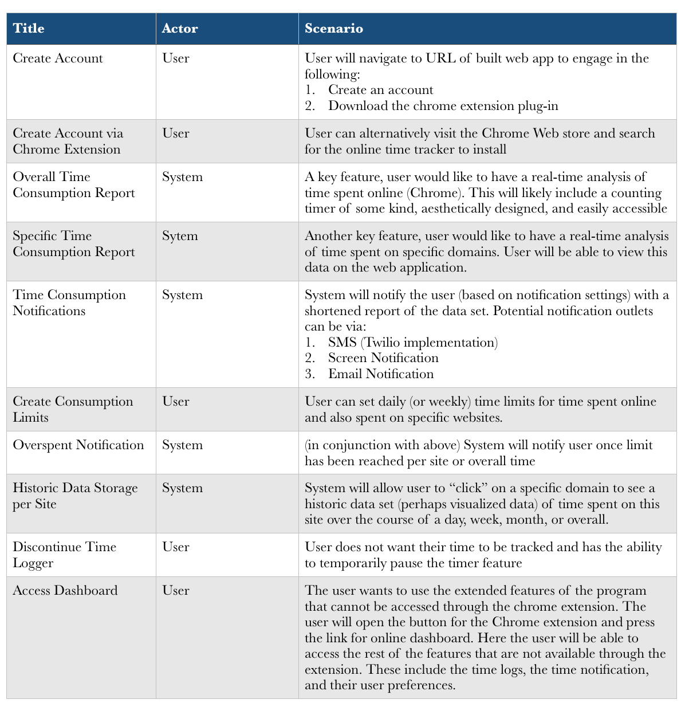
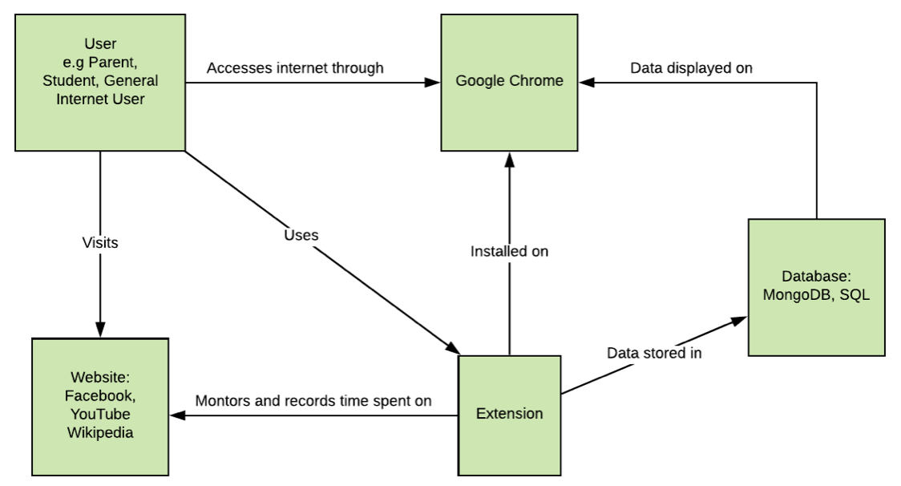

# Project Requirements

### Stakeholder Interview Questions / Responses
1. Who is the target audience that you see using this product?

   Geared towards anyone that wants to take advantage of tracking their time spent online…the MVP will be built as such keeping a general backlog of all information, domains, sites, being used by users. It is probably that those most interested are people “more connected” to the internet (via social media, smartphone usage, etc.), so we will also incorporate products and features that are built around this as well.  
2. What do you expect from the first iteration of this product?  

   Must be easy to use, deployed on Heroku server (web app) and Chrome Extension
3. Do you have any concerns about technical aspects of the project?

   Main concerns are being up to speed with Javascript, Node, Express, MongoDB
4. Do you have any concerns about non-technical or ethical aspects of the project?

   Not really
5. What are the most important features to include in order to capture our target?

   Text Notifications, Some sort of charts or data visualization, basic features discussed, etc.
6. Are there specific technologies/tools you would like us to employ? If any?

   Twilio
7. Where do you see this product, ideally, in a year?

   Perhaps to incorporate (in the longer term) a mobile integration to track time spent on mobile apps, chrome on the phone, etc, to get a more realistic statistic as many target users spend just as much time (if not more) in their smart phones doing the same things that would be done on desktops or laptops  

### End-User Observations
* Potential User 1:
   Benjamin H. Bourquin is a high-school student that has finals coming up and he is worried that he won’t be able to stay focused. He often gets distracted on the Internet and forgets to study. He wants to help manage his time, while keeping a healthy control of how much time he allocates for internet-use. He would be able to create goals, timers, and alarms to better gauge where he is spending his time, how much, and maybe even (regarding school-work) what sites he is using most to help his progression in school.

* Potential User 2:
   Benito M. Bolt is a parents of three kids. Two of his kids are in high school and one is in middle school. Two of his kids have been recently getting poor grades at school and they seem to be consistently distracted by their computers. He would like to find the root cause of his kids academic issues and help his kids find a healthy balance between studying and relaxation. With the Online Time Tracker, he would be able to monitor his kids internet usage, what the internet is being used for, and work with his children to find a healthy middle ground between school and fun.

* Potential User 3:
   Marcy Coles is graduate student working on her thesis. She often spends much of her day on the Internet doing research for her work. Lately she’s been falling behind with her work and she thinks it might be because of her social media usage. Marcy wants to see exactly how much she spends on specific websites so she can know what sites to avoid so she doesn’t get distracted. She could do it with timers and spreadsheets, but it’d be much easier if there were an all-in-one solution that recorded her usage while she went about her day online. With Online Time Tracker, she can constantly check in on her real-time Internet usage.

### Use Cases

### Domain Modeling

